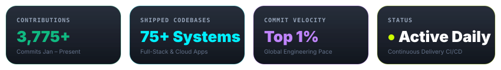

<div align="center">



<br/><br/>

<p align="center">
  <a href="https://www.linkedin.com/in/sanjay-kumar-9639a6257"></a>
  &nbsp;
  <a href="mailto:contactsanjaykumar@gmail.com"></a>
  &nbsp;
  <a href="https://instagram.com/sanjay.o_0"></a>
  &nbsp;
  <a href="https://github.com/SaNjAy-bRo"></a>
</p>



</div>

---

### ⚡ Technical Profile & Core Competencies

```typescript
interface SystemArchitect {
  developer: "Sanjay Kumar";
  specialization: "Creative Full-Stack Architecture & High-Conversion Funnels";
  languages: ["TypeScript", "JavaScript (ESNext)", "Python", "SQL", "GLSL Shaders"];
  frontend: ["Next.js 15 (App Router)", "React 19", "TailwindCSS", "Three.js / WebGL", "Framer Motion"];
  backend: ["Django REST Framework", "FastAPI", "Node.js", "PostgreSQL", "Redis Caching"];
  performanceStandard: "100/100 Core Web Vitals • Sub-40ms TTFB • 0.000 CLS";
  availability: "Open to High-Impact Engineering Roles & Strategic Technical Contracts";
}
```

---

### 💬 Verified Client Endorsement

> ❝ **Huge thanks for crushing the recent release! Your clean code, fast problem-solving, and calm focus under pressure made all the difference. We are lucky to have your skill on the team.** ❞
> 
> — **Loka Shankaraha**, *Credit Consultant & Financial Advisory*

---

### 🛠️ Technology Stack & Ecosystem

<table>
  <tr>
    <td align="center" width="25%"><strong>Frontend &amp; Creative 3D</strong></td>
    <td>
      <a href="https://skillicons.dev">
        
      </a>
    </td>
  </tr>
  <tr>
    <td align="center" width="25%"><strong>Backend &amp; Databases</strong></td>
    <td>
      <a href="https://skillicons.dev">
        
      </a>
    </td>
  </tr>
  <tr>
    <td align="center" width="25%"><strong>Cloud, DevOps &amp; Tooling</strong></td>
    <td>
      <a href="https://skillicons.dev">
        
      </a>
    </td>
  </tr>
</table>

---

### 🚀 Flagship Shipped Platforms

<table>
  <thead>
    <tr>
      <th>Platform</th>
      <th>Domain</th>
      <th>Architecture</th>
      <th>Key Performance Outcomes</th>
    </tr>
  </thead>
  <tbody>
    <tr>
      <td><strong>🏎️ <a href="https://www.turboridesupercars.com/">Turbo Ride Supercars</a></strong></td>
      <td>Luxury Mobility</td>
      <td><code>Next.js 15</code> <code>Stripe Vault</code> <code>Django</code></td>
      <td><strong>+185% Bookings Lift</strong> • Sub-second Checkout • 0.000 CLS</td>
    </tr>
    <tr>
      <td><strong>🥥 <a href="https://www.drinkcocofuse.com/">COCO FUSE</a></strong></td>
      <td>D2C 3D Commerce</td>
      <td><code>React 19</code> <code>Shopify</code> <code>GLSL Shaders</code></td>
      <td><strong>3-Flavor Liquid Visualizer</strong> • 2.4x Cart Uplift • 60 FPS</td>
    </tr>
    <tr>
      <td><strong>🛡️ <a href="https://ssquad.com/">SSquad Global</a></strong></td>
      <td>Enterprise Defense</td>
      <td><code>React 19</code> <code>TypeScript</code> <code>Cloud Infra</code></td>
      <td><strong>Real-Time Threat HUD</strong> • Sub-12ms Telemetry • Zero-Trust SOC2</td>
    </tr>
    <tr>
      <td><strong>🛥️ <a href="https://yachtclubindia.com/">Yacht Club India</a></strong></td>
      <td>Luxury Maritime</td>
      <td><code>Django</code> <code>FastAPI</code> <code>Framer Motion</code></td>
      <td><strong>500+ Luxury Charters</strong> • Goa Route Planner • 4.9★ CSAT</td>
    </tr>
    <tr>
      <td><strong>👗 <a href="https://www.tanubhi.com/">Tanubhi Couture</a></strong></td>
      <td>Haute Couture &amp; Spa</td>
      <td><code>Next.js 15</code> <code>Redis</code> <code>TypeScript</code></td>
      <td><strong>Multi-Stylist Slot Calendar</strong> • &lt;20s Reservation Flow</td>
    </tr>
  </tbody>
</table>

---

<div align="center">

### 💬 Ready to Engineer Something Extraordinary?

Whether you are launching a flagship digital platform, optimizing transaction velocity, or building immersive 3D experiences:

**[📬 Send an Email](mailto:contactsanjaykumar@gmail.com)** • **[💼 LinkedIn Connect](https://www.linkedin.com/in/sanjay-kumar-9639a6257)** • **[🌐 Visit GitHub Profile](https://github.com/SaNjAy-bRo)**

</div>
